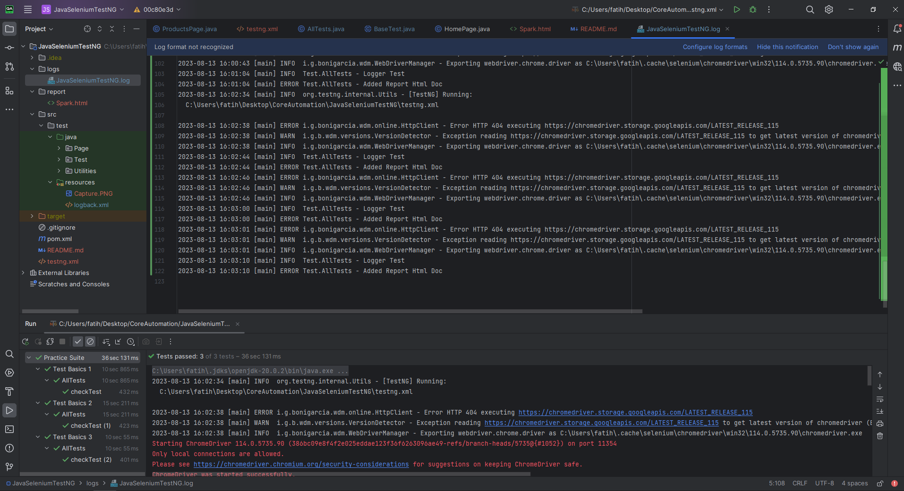
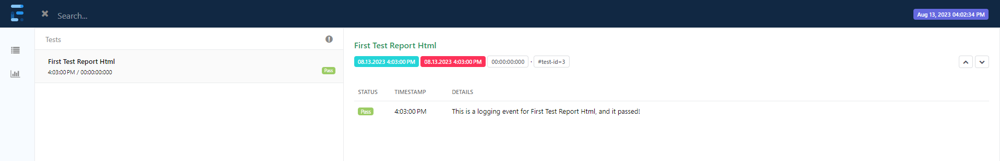

# Selenium WebDriver TestNG Framework

Automating functional UI and end to end tests for www.amazon.com.tr website. This project uses the page object model (POM) design. At the moment, only infrastructure works have been done.

## Stack & Libraries
 - Java 
 - Selenium WebDriver
 - TestNG
 - Maven
 - Extent Reports and logging

## How to run tests

In terminal:
```
git clone https://github.com/fatihmcicek/JavaSeleniumTestNG.git
```
Change directory to the location of cloned project folder and run Maven clean
```
mvn clean
```
To run the test
```
mvn test
```





